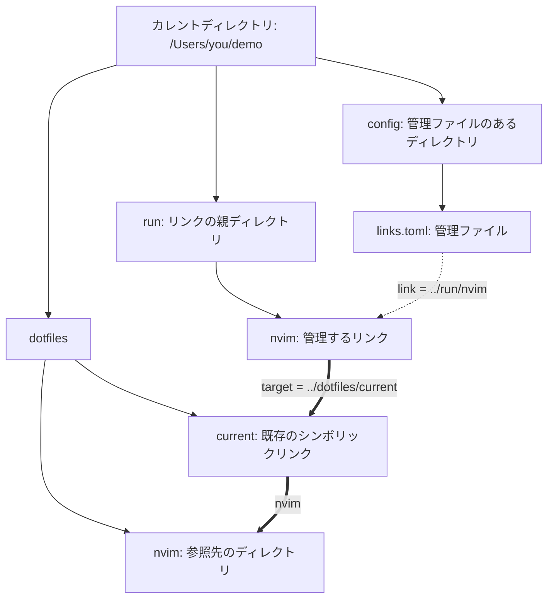

# slink

[English](README.md) | [日本語](README.ja.md)

macOS向けのシンボリックリンク管理CLIです。リンクを作成し、意図したリンク先を手編集できるTOMLファイルに記録して、あとから検査・復元・削除できます。

## インストール

現在の安定版Rustツールチェーンを使用します。

```sh
git clone https://github.com/kkensuke/slink.git
cd slink
cargo install --path . --locked
```

成功したmacOSのCIジョブからは、リリース用実行ファイルをActionsのartifactとして取得することもできます。利用対象のOSはmacOSです。LinuxのCIでは、共通の処理を検証します。

## パスの用語と基準

シンボリックリンクは、パスを文字列として格納します。slinkでは、`link` が**シンボリックリンクを置く場所**、`target` が**そのリンクに格納するパス文字列**を指定します。`target` のパスは、ファイル、ディレクトリ、または別のシンボリックリンクを指すことができます。

**カレントディレクトリ**は、コマンドを実行するディレクトリです。`pwd -P` でその物理的なパスを表示できます。**管理ファイル**は、slinkの登録情報を記述するTOMLファイルです。`--file` または後述の既定値によって場所を選びます。**管理ファイルのあるディレクトリ**は、選択した管理ファイルを置いているディレクトリです。**リンクの親ディレクトリ**は、シンボリックリンクを置いているディレクトリです。

次の例では、カレントディレクトリを `/Users/you/demo`、管理ファイルを `/Users/you/demo/config/links.toml` とします。図中の親ディレクトリは通常のディレクトリです。`dotfiles/current` は既存のシンボリックリンクで、文字列 `nvim` を格納しており、ディレクトリ `dotfiles/nvim` を指しています。

管理ファイルの内容は次のとおりです。

```toml
version = 1

[[links]]
link = "../run/nvim"
target = "../dotfiles/current"
```

図は、この登録項目が記述するリンクを示しています。細い実線はディレクトリに含まれるもの、点線は登録項目とリンクの対応、太い矢印はシンボリックリンクの参照を表します。



| 用語 | 図中の具体的な値 |
| --- | --- |
| カレントディレクトリ | `/Users/you/demo` |
| 管理ファイル | `/Users/you/demo/config/links.toml` |
| 管理ファイルのあるディレクトリ | `/Users/you/demo/config` |
| リンクの配置先 (`link`) | `/Users/you/demo/run/nvim`。管理ファイルの `../run/nvim` から求められる場所 |
| リンクの親ディレクトリ | `/Users/you/demo/run` |
| 格納されたターゲット文字列 (`target`) | `../dotfiles/current` |
| そのtargetが指す既存のシンボリックリンク | `/Users/you/demo/dotfiles/current` |
| 両方のシンボリックリンクを辿って到達するディレクトリ | `/Users/you/demo/dotfiles/nvim` |

`readlink /Users/you/demo/run/nvim` が返すのは `../dotfiles/current` です。最終的なディレクトリのパスを返すわけではありません。slinkが管理するのは `run/nvim` です。`dotfiles/current` を参照しても、その既存リンクを自動で登録したり変更したりはしません。`link` と `target` は1つの参照における役割の名前なので、target自体がさらに別のシンボリックリンクであっても構いません。

### 相対パスの基準

絶対パスは `/` で始まります。たとえば `/Users/you/demo/run/nvim` です。`run/nvim` や `../run/nvim` のような相対パスには、基準となるディレクトリが必要です。上の例では次のようになります。

| 入力 | 基準となるディレクトリ・規則 | 結果 |
| --- | --- | --- |
| CLIの `--file config/links.toml` | カレントディレクトリ | `/Users/you/demo/config/links.toml` |
| CLIのlink引数 `run/nvim` | カレントディレクトリ | `/Users/you/demo/run/nvim` |
| 管理ファイルの `link = "../run/nvim"` | 管理ファイルのあるディレクトリ | `/Users/you/demo/run/nvim` |
| 管理ファイルの `target = "../dotfiles/current"` | リンクを辿るときの、リンクの親ディレクトリ | `/Users/you/demo/dotfiles/current` |
| `--relative` なしのCLIのtarget引数 `dotfiles/current` | そのまま格納し、リンクの親ディレクトリから辿る | `/Users/you/demo/run/dotfiles/current` |
| `--relative` ありのCLIのtarget引数 `dotfiles/current` | 指定されたパスをカレントディレクトリから解釈し、リンクの親ディレクトリからのパスを格納する | `../dotfiles/current` を格納し、`/Users/you/demo/dotfiles/current` を参照する |

たとえば、管理ファイルのtargetは `/Users/you/demo/run` を基準に解釈します。`..` で1つ上に移動してから、`dotfiles/current` に進みます。相対targetの基準がリンクの親ディレクトリになるのは、OSがその規則でシンボリックリンクを辿るためです。OSがリンクを辿る際には、管理ファイルの場所は関係しません。

## コマンド

それぞれ独立した使用例です。

```sh
slink ~/dotfiles/zshrc ~/.zshrc
slink --relative --parents ~/dotfiles/nvim ~/.config/nvim
slink list
slink check
slink fix --dry-run
slink fix --parents
slink fix --replace ~/.zshrc
slink remove ~/.zshrc
slink remove --keep-link ~/.config/nvim
slink adopt ~/.gitconfig ~/.tmux.conf
slink scan ~/.config
```

| コマンド | 役割 |
| --- | --- |
| `slink <target> <link>` | シンボリックリンクを作り、`link` / `target` の登録項目を管理ファイルに追加する |
| `slink list` | 実際のリンクを検査せず、登録項目を表示する |
| `slink check [link ...]` | 登録されたリンクをtargetの格納文字列と照合し、参照先に到達できるかも報告する |
| `slink fix [link ...]` | 欠落したリンクを復元する。不一致のリンクを置き換えるには `--replace` が必要 |
| `slink remove <link ...>` | 登録内容と一致するリンクと、その登録項目を削除する。参照先のファイルやディレクトリは残す |
| `slink adopt <link ...>` | 既存のシンボリックリンクを変更せず、その登録項目を追加する |
| `slink scan <directory ...>` | シンボリックリンクを探索する。登録は行わない |

`check` と `fix` は、リンクの指定を省略すると、選択した管理ファイルの全項目を対象にします。`remove` と `adopt` では、リンクのパスを明示する必要があります。`scan` は通常のディレクトリを再帰的に探索し、ディレクトリを指すシンボリックリンクは辿りません。探索の開始地点も通常のディレクトリである必要があります。

### リンクの配置先がすでに存在する場合

`slink --relative --parents ~/dotfiles/nvim ~/.config/nvim` でリンクを置く場所は、正確に `~/.config/nvim` です。`--parents` は、親の `~/.config` がなければ作成できます。既存の `~/.config/nvim` ディレクトリをリンクに変換したり、そのディレクトリの中に別のリンクを作成したりはしません。

| `~/.config/nvim` に何があるか | この作成コマンドの結果 |
| --- | --- |
| 何もなく、そのパスが未登録 | リンクを作成して登録する |
| 通常のディレクトリ。空であっても同様 | エラー。ディレクトリと中身は変更しない |
| 通常のファイル | エラー。ファイルは変更しない |
| 未登録のシンボリックリンク。ディレクトリを指すものも含む | エラー。既存リンクを登録するには `slink adopt ~/.config/nvim` を使う |
| 登録済みのシンボリックリンクで、登録されたtarget文字列と実際のtarget文字列が、両方ともこのコマンドのtarget文字列と一致する | `UNCHANGED` と報告し、再作成せず成功する |
| 登録済みのパスが、それ以外の状態にある | エラー。`check` で状態を調べ、必要に応じて `fix` を使う |

target文字列は完全一致で比較します。異なる2つの文字列が結果的に同じファイルに到達しても、この比較では異なるtargetとして扱います。`--parents` も `fix --replace` も、通常のディレクトリの上書きを許可するものではありません。

### `--` の意味

`--` はオプションの解釈を終了し、それ以降の引数をそのままパスとして扱うための区切りです。作成コマンドの最初のパスより前に置くと、そのパスがサブコマンド名として解釈されることも防ぎます。

| 例 | 意味 |
| --- | --- |
| `slink -- list ./list-link` | target文字列が `list` の `./list-link` を作成する。ここでの `list` はパスであり、一覧表示のサブコマンドではない |
| `slink check ./list-link` | 登録された `./list-link` のリンクだけを検査する |
| `slink check -- ./list-link` | 同じ検査を行う。このパスは `-` で始まらないため、`--` は省略できる |
| `slink check -- -link` | `-link` という名前の登録済みリンクを検査する。`--` によってオプションとしての解釈を防ぐ |

ここでの `./list-link` は、カレントディレクトリにある `list-link` という意味です。`check` は、そのリンクを作成したり登録したりしません。

## 管理ファイル

### ファイルの選択

`XDG_CONFIG_HOME` に `/Users/you/config` のような絶対パスが設定されている場合、既定の管理ファイルは `$XDG_CONFIG_HOME/slink/links.toml` です。変数が未設定、空、または `config` や `./config` のような相対パスの場合は、代わりに `~/.config/slink/links.toml` を使います。ここでいう「相対」は環境変数に設定されたパスの値のことで、`--relative` オプションとは関係ありません。

`--file` は、別の管理ファイルを1つだけ選択します。複数ファイルの結合や自動探索は行いません。`--file` に指定する相対パスは、カレントディレクトリを基準にします。

```sh
cd /Users/you/demo
slink --file config/links.toml check
```

この指定では `/Users/you/demo/config/links.toml` が選ばれるため、管理ファイルのあるディレクトリは `/Users/you/demo/config` です。

### 管理ファイルの `link` に相対パスを使える理由

プロジェクト用の管理ファイルを手で書く場合、図のように `link = "../run/nvim"` と記述できます。管理ファイルのあるディレクトリを基準にすることで、どのカレントディレクトリからslinkを実行しても同じリンクを指定できます。プロジェクトのディレクトリ構成をまとめて移動すれば、管理ファイルとリンクの配置先の位置関係も維持されます。

`link` を相対パスにすることは必須ではありません。個人用の管理ファイルでは、`~/...` や絶対パスの方が読みやすい場合もあります。CLIでの作成と `adopt` は、自動で絶対パスの `link` を書き込みます。他の項目を変更するときも、手書きのパス表記、コメント、項目の順序、引用符の種類、CRLFの改行は保持します。

### `~`・変数・シェルによる展開

`ln -s ~/dotfiles/nvim ~/.config/nvim` のようなコマンドでは、`ln` が起動する**前にシェルが** `~` を展開します。`slink` の起動前にも、同じ展開が行われます。

```sh
slink ~/dotfiles/nvim ~/.config/nvim
slink "$HOME/dotfiles/nvim" "$HOME/.config/nvim"
```

どちらも、ホームディレクトリを展開したパスをslinkに渡します。これは同じ指定の別表記であり、順番に実行する手順ではありません。targetをシングルクォートで囲むと、シェルは展開しません。

```sh
ln -s '~/dotfiles/nvim' ./nvim-link
slink '~/dotfiles/nvim' ./nvim-link
```

これらも別々の指定例です。どちらも、文字列 `~/dotfiles/nvim` をそのまま格納します。このリンクを辿る場合、`~` はリンクの親ディレクトリ内にあるディレクトリ名として扱われ、ホームディレクトリを意味しません。

TOMLファイルはデータであり、シェルで評価されません。slinkには1つだけ明示的な補助機能があり、管理ファイルの `link` が `~/` で始まる場合は、ユーザーのホームディレクトリへ展開します。どちらのフィールドでも、変数やシェルの式は展開しません。管理ファイルの `target` は、シンボリックリンクに格納する文字列そのものとして保持するため、`~` も展開しません。これにより、`adopt` で既存リンクの文字列を記録し、`fix` で意味を変えずに再現できます。

たとえばホームディレクトリが `/Users/you` の場合、次の項目は `/Users/you/.config/nvim` にリンクを置き、`/Users/you/dotfiles/nvim` を参照します。

```toml
version = 1

[[links]]
link = "~/.config/nvim"
target = "../dotfiles/nvim"
```

同じ参照先を指定するには、`target = "/Users/you/dotfiles/nvim"` と書いても構いません。`target = "~/dotfiles/nvim"` は、そのホームディレクトリから始まる絶対パスを意味しません。

### 項目を手で編集する

1つの登録項目は、`link` と `target` を含む完全な `[[links]]` ブロックです。「登録済み」とは、選択した管理ファイルにその項目が存在することを意味します。過去に登録されていたリンクの一覧を別に保持するわけではありません。

| 手編集の内容 | 効果 |
| --- | --- |
| 項目を追加する | `fix` で、その項目の欠落したリンクを作成できる |
| 項目の `target` を変更する | 既存の不一致リンクが変わるのは、`fix --replace` を実行したときだけ |
| 項目全体を削除する | 実際のリンクは残るが、この管理ファイルによる `list`・`check`・`fix` の対象から外れる |
| 項目の `link` を変更する | 古いリンクは残り、そのパスの登録はなくなる。`fix` で新しいパスにリンクを作成できる |

1つの項目を削除するとは、`[[links]]` の見出しと両方のフィールドを削除することです。`link` または `target` だけを削除すると、不正な項目が残ってしまいます。たとえば `~/.config/nvim` の唯一の登録項目を削除しても、リンク自体はそれまでどおり機能します。ただし、あとからそのリンクがなくなっても、`slink fix` は復元しなくなります。

リンクと登録項目を両方削除するには、**項目がまだ残っている間に** `slink remove <link>` を実行します。参照先のファイルやディレクトリは残ります。`slink remove --keep-link <link>` は登録項目だけを削除します。すでに手編集で項目を削除した場合、残ったリンクは未登録として扱われます。`adopt` で再登録しない限り、`remove` はそのリンクを削除しません。

### 管理ファイル自体がシンボリックリンクの場合

slinkは、その参照先の通常ファイルを更新し、管理ファイルのシンボリックリンクを残します。相対的な `link` 値の基準は、引き続き**選択した管理ファイルのパス**があるディレクトリです。

たとえば `/Users/you/demo/config/links.toml` を選択し、そのファイルが `/Users/you/store/shared.toml` へのシンボリックリンクだったとしても、`link = "../run/nvim"` は `/Users/you/demo/run/nvim` を指定します。基準は `/Users/you/demo/config` のままです。

これにより、TOMLデータの実体を別の場所に置きながら、選択した管理ファイルのパスでプロジェクトの場所を決められます。同じデータでも、異なるディレクトリのファイルパスを通じて選択すると、相対的な `link` 値が指す配置先は変わり得ます。選択した管理ファイルのパスによって意味を変えたくない場合は、`link` に絶対パスまたは `~/...` を使ってください。

## オプションと既定動作

### `--relative`

**target引数**は、`slink <target> <link>` で指定し、シェルによる展開を済ませたパスです。`--relative` がなければ、slinkは `ln -s` と同様に、この引数をそのまま格納します。相対パスであれば、OSはリンクの親ディレクトリから辿ります。

`--relative` がある場合、slinkはまずtarget引数をカレントディレクトリから解釈し、次にリンクの親ディレクトリからの相対パスを計算してtarget文字列にします。図の登録項目を手で書く代わりに、CLIでリンクを作る場合は次のようになります。

```sh
cd /Users/you/demo
slink --file config/links.toml --relative --parents dotfiles/current run/nvim
```

target引数は `dotfiles/current`、格納されるtarget文字列は `../dotfiles/current` です。CLIは `link` に絶対パスの `/Users/you/demo/run/nvim` を書き込みます。これは、図の手書きの `../run/nvim` と同じリンクを指定します。

指定したtargetのパスが別のシンボリックリンクを指したり、途中で通過したりする場合、slinkはその参照を格納するtarget文字列に残します。図では、最終的なディレクトリ `nvim` に置き換えず、`current` を残します。あとから既存の `current` リンクが別の参照先に変更された場合、管理するリンクも新しい参照を辿ります。

同様に、`..` も単なる文字列としては簡略化できないことがあります。`alias` が `tree/child` を指す既存のシンボリックリンクだとします。同じカレントディレクトリから次を実行します。

```sh
slink --relative --parents alias/../data run/data
```

格納されるtargetは `../alias/../data` です。これを辿ると、`alias` を通って `tree/child` に入り、その親の `tree/data` に進みます。`alias/../data` を `data` に置き換えると、別のパスに到達してしまいます。slinkは、この辿り方を維持します。また、相対targetの計算ではリンクの親ディレクトリに含まれるシンボリックリンクも考慮し、その実際の場所から計算を始めます。

`--relative` が任意指定なのは、自動変換すると相対target引数の解釈が変わるためです。相対targetは、参照先とリンクを含むディレクトリ構成をまとめて移動した場合に機能し続けられますが、リンクだけを移動すると切れる場合があります。

### `--parents`

`--parents` は、作成または `fix` の際に、欠けているリンクの親ディレクトリを作ります。`target` が指すファイルやディレクトリは作りません。リンクの親ディレクトリの入力ミスを黙って作成せず報告するため、任意指定にしています。リンクを削除しても、親ディレクトリは残ります。あとから親ディレクトリが削除された場合、その復元には再び `fix --parents` が必要です。

管理ファイルには `relative` や `parents` の設定を保存しません。`--relative` は `target` に保存する文字列を決め、`--parents` は今回のコマンドだけに適用します。`fix` は保存されたtarget文字列を使い、再変換しません。

### その他のオプションと標準動作

`--dry-run` は、作成・`fix`・`remove`・`adopt` で使えます。ロックファイル、復旧記録、親ディレクトリも含め、一切書き込みません。複数項目のプレビューでは、先に予定された登録・登録解除を後続の項目に反映します。復旧のプレビューでは、計画を表示する前に管理ファイルの編集や配置先の競合を確認します。

`--keep-link` は `remove`、`--replace` は `fix` だけで使えます。`--relative` は作成、`--parents` は作成または `fix` だけで使えます。不正なオプションの組み合わせはエラーになります。

新しく作成したリンクの自動登録、TOML書式の保持、通常のファイル・ディレクトリの保護、存在しないtargetの許可と報告は、常に有効です。判断理由は[既定動作の説明](docs/defaults.md)を参照してください。

## 保護と復旧

存在しないtargetへのリンクは作成でき、その状態を報告します。`fix --replace` が通常のファイルやディレクトリを上書きしたり、`remove` がそれらを削除したりすることはありません。未登録の既存シンボリックリンクは、先に `adopt` で登録する必要があります。変更された登録済みリンクは、明示的に置き換えるか、`--keep-link` で登録解除する必要があります。

選択した管理ファイル、制御用ファイル、それらの親パスは、管理するリンクの配置先にできません。管理ファイルを含むディレクトリをリンクとして管理する必要がある場合は、`--file` で別の場所の管理ファイルを選んでください。

変更を行うコマンドは管理ファイルをロックし、保存前にファイルの内容を再度比較します。作成・登録、削除、置き換えが中断された場合は、小さな操作記録を残します。失敗したリンクに対して、同じtargetとオプションで操作を繰り返すと再開できます。`check` は未完了のリンクを示します。複数削除が途中まで完了している場合は、先の項目で登録解除済みになったパスを除いてください。復旧が解決するまで、無関係な変更操作は停止します。復旧時には実際のファイルを再検査し、競合する手編集を上書きしません。

置き換え・削除では、古いリンクを元の場所の隣にある専用ディレクトリへ一時的に移し、同じリンクであることを確認してから、その確認済みのシンボリックリンクだけを削除します。想定外のものは残します。置き換え中は、リンク名が一時的に存在しない期間が生じることがあります。

登録情報の実体を保存する通常ファイルの隣には、`.slink-lock`、また操作が未完了の間は `.slink-pending` という接尾辞の制御用ファイルが置かれることがあります。たとえば `links.toml.slink-pending` です。中断した操作を解決する前に、未完了記録や `.slink-*` の復旧用ディレクトリを削除しないでください。ロックはslink同士の実行を調整するもので、任意のエディタを制御するものではありません。複数項目をまとめた原子性や、あらゆる電源断からの復旧は保証しません。あとに続く項目が失敗しても、完了した項目は保持します。

対応するパスとtarget文字列はUTF-8である必要があります。管理するリンクの配置先の入れ子には対応せず、配置先の紛らわしい表記は安全側に倒して拒否します。`..` を含む親パスが存在しない場合、推測せず、明示的に解決する必要があります。必要な排他的動作を提供できないファイルシステム操作は、既存のパスを上書きする代替処理に切り替えず、エラーになります。

## 終了コード

| コード | 意味 |
| --- | --- |
| 0 | 要求した操作が完了した。`check` の場合は、選択した全項目が正常 |
| 1 | `check` が問題を検出した、項目の処理が失敗・競合した、または探索が不完全だった |
| 2 | 引数・管理ファイルが不正、管理ファイルを利用できない、または復旧を妨げるエラーがある |

リンクの作成や復元に成功すれば、targetが存在しなくても0を返します。そのtargetに対する `check` は1を返します。`scan` は、壊れたリンクを見つけただけでは失敗しません。通常の `fix` が不一致のリンクを修復せず残した場合は、1を返します。

## 開発

```sh
cargo fmt --check
cargo clippy --locked --all-targets -- -D warnings
cargo test --locked
cargo build --locked --release
```

統合テストは、独立した管理ファイルを使って実際の実行ファイルを動かし、変更の各段階での強制終了と復旧も検証します。障害を意図的に発生させる仕組みはデバッグビルドだけに組み込まれます。リリース用実行ファイルは、テスト用の強制終了変数を無視します。
