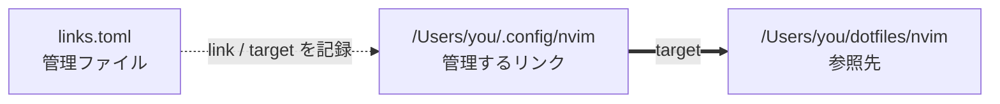

# slink

[English](README.md) | [日本語](README.ja.md)

macOS向けのシンボリックリンク管理CLIです。リンクを作成し、その内容を手編集できるTOMLファイルに記録して、あとから検査・復元・削除できます。

## インストール

現在の安定版Rustツールチェーンを使用します。

```sh
git clone https://github.com/kkensuke/slink.git
cd slink
cargo install --path . --locked
```

成功したmacOSのCIジョブからは、リリース用実行ファイルをActionsのartifactとして取得することもできます。利用対象のOSはmacOSです。LinuxのCIでは、共通の処理を検証します。

## まず使ってみる

`slink <target> <link>` でシンボリックリンクを作成し、同時に管理ファイルへ登録します。最初は絶対パスで考えるのが簡単です。

たとえば `/Users/you/dotfiles/nvim` を `/Users/you/.config/nvim` から使いたい場合は、次を実行します。

```sh
slink --parents /Users/you/dotfiles/nvim /Users/you/.config/nvim
```

これで `/Users/you/.config/nvim` というシンボリックリンクが作られ、`/Users/you/dotfiles/nvim` を指します。`--parents` は、リンクを置く親ディレクトリ `/Users/you/.config` がなければ作成します。すでに `/Users/you/.config/nvim` に通常のファイルやディレクトリがある場合は上書きしません。



管理ファイルには概ね次のように保存されます。

```toml
version = 1

[[links]]
link = "/Users/you/.config/nvim"
target = "/Users/you/dotfiles/nvim"
```

あとは、登録内容の確認や復元を次のように行えます。

```sh
slink list
slink check
slink fix --dry-run
```

相対targetを保存したい場合は `--relative` を使えます。たとえば同じリンクを `../dotfiles/nvim` として保存できます。相対パスの基準や、プロジェクト用の管理ファイルを相対 `link` で手書きする方法は、後述の[パスのモデル](#パスのモデル)と[`--relative`](#--relative)を参照してください。

## コマンド

```sh
slink <target> <link>
slink list
slink check [link ...]
slink fix [--parents] [--replace] [link ...]
slink remove [--keep-link] <link ...>
slink adopt <link ...>
slink scan <directory ...>
```

| コマンド | 役割 |
| --- | --- |
| `slink <target> <link>` | シンボリックリンクを作り、`link` / `target` を管理ファイルに追加する |
| `slink list` | 実際のリンクを検査せず、登録内容を表示する |
| `slink check [link ...]` | 登録されたリンクが保存済みtargetと一致するか、targetへ到達できるかを検査する |
| `slink fix [link ...]` | 欠落したリンクを復元する。不一致のリンクを置き換えるには `--replace` が必要 |
| `slink remove <link ...>` | 登録内容と一致するリンクと登録項目を削除する。参照先は削除しない |
| `slink adopt <link ...>` | 既存のシンボリックリンクを変更せず登録する |
| `slink scan <directory ...>` | 指定したディレクトリ以下のシンボリックリンクを探索する。登録はしない |

`check` と `fix` はリンクを省略すると、選択した管理ファイルの全項目を対象にします。`remove` と `adopt` ではリンクを明示します。`scan` は通常のディレクトリを再帰的に探索し、ディレクトリを指すシンボリックリンクは辿りません。

### リンクの配置先がすでに存在する場合

たとえば次のコマンドでリンクの配置先は正確に `/Users/you/.config/nvim` です。

```sh
slink --parents /Users/you/dotfiles/nvim /Users/you/.config/nvim
```

| 配置先にあるもの | 結果 |
| --- | --- |
| 何もなく、未登録 | リンクを作成して登録する |
| 通常のディレクトリ | エラー。中身も変更しない |
| 通常のファイル | エラー。変更しない |
| 未登録のシンボリックリンク | エラー。既存リンクを登録するには `adopt` を使う |
| 登録済みで、登録targetと実際のtargetがコマンドのtargetと一致 | `UNCHANGED` と報告して成功する |
| 登録済みだが、それ以外の状態 | エラー。`check` で確認し、必要に応じて `fix` を使う |

target文字列は完全一致で比較します。異なる文字列が最終的に同じファイルへ到達しても、異なるtargetとして扱います。`--parents` や `fix --replace` でも通常のファイルやディレクトリは上書きしません。

## パスのモデル

シンボリックリンクは、参照先のパスを文字列として格納します。slinkでは次の用語を使います。

- **link**: シンボリックリンクを置く場所
- **target**: そのシンボリックリンクに格納するパス文字列
- **カレントディレクトリ**: コマンドを実行するディレクトリ
- **管理ファイル**: slinkの登録内容を保存するTOMLファイル
- **管理ファイルのあるディレクトリ**: 選択した管理ファイルを置いているディレクトリ
- **リンクの親ディレクトリ**: linkを含むディレクトリ

絶対パスは `/` から始まるため、基準ディレクトリに依存しません。相対パスでは、どこを基準に解釈するかが重要です。

### 相対パスの基準

次の例では、カレントディレクトリを `/Users/you/demo`、管理ファイルを `/Users/you/demo/config/links.toml` とします。

| 入力 | 基準 | 例 |
| --- | --- | --- |
| CLIの `--file config/links.toml` | カレントディレクトリ | `/Users/you/demo/config/links.toml` |
| CLIのlink引数 `run/nvim` | カレントディレクトリ | `/Users/you/demo/run/nvim` |
| 管理ファイルの `link = "../run/nvim"` | 管理ファイルのあるディレクトリ | `/Users/you/demo/run/nvim` |
| 相対target文字列 `../dotfiles/nvim` | リンクの親ディレクトリ | linkが `/Users/you/demo/run/nvim` なら `/Users/you/demo/dotfiles/nvim` |

相対targetがリンクの親ディレクトリを基準にするのは、OSがシンボリックリンクをその規則で辿るためです。リンクを辿るときに、管理ファイルの場所は使われません。

`--relative` を付けないCLIのtarget引数は、`ln -s` と同様、その文字列をそのまま格納します。たとえば `/Users/you/demo` で次を実行すると、格納されるtargetは文字列 `dotfiles/nvim` のままです。

```sh
slink --parents dotfiles/nvim run/nvim
```

その結果、OSは `/Users/you/demo/run` から `dotfiles/nvim` を辿るため、`/Users/you/demo/run/dotfiles/nvim` を参照します。

同じ入力をカレントディレクトリ `/Users/you/demo` の `dotfiles/nvim` として解釈し、その場所を正しく指す相対targetを作りたい場合は `--relative` を使います。

```sh
slink --relative --parents dotfiles/nvim run/nvim
```

この場合、格納されるtargetは `../dotfiles/nvim` です。

## 管理ファイル

### ファイルの選択

`XDG_CONFIG_HOME` に `/Users/you/config` のような絶対パスが設定されている場合、既定の管理ファイルは `$XDG_CONFIG_HOME/slink/links.toml` です。未設定、空、または `config` や `./config` のような相対パスの場合は `~/.config/slink/links.toml` を使います。ここでいう「相対」は環境変数の値についてであり、`--relative` とは無関係です。

`--file` は別の管理ファイルを1つだけ選択します。複数ファイルの結合や自動探索はしません。相対 `--file` はカレントディレクトリ基準です。

```sh
cd /Users/you/demo
slink --file config/links.toml check
```

この場合は `/Users/you/demo/config/links.toml` を使います。

### 管理ファイルの `link` に相対パスを使う

CLIで作成または `adopt` すると、管理ファイルの `link` は絶対パスで書き込まれます。通常の個人用設定では、この形式が最も分かりやすいでしょう。

一方、プロジェクト用の管理ファイルを手で書く場合は、相対 `link` が便利です。

```toml
version = 1

[[links]]
link = "../run/nvim"
target = "../dotfiles/nvim"
```

管理ファイルが `/Users/you/demo/config/links.toml` にあるなら、この `link` は `/Users/you/demo/run/nvim` を意味します。管理ファイルとリンクの位置関係を保ったままプロジェクト全体を移動すれば、同じTOMLを使い続けられます。

相対 `link` は必須ではありません。個人用の管理ファイルでは、絶対パスまたは `~/...` の方が読みやすい場合があります。slinkは、他の項目を変更するときも手書きのパス表記、コメント、順序、引用符の種類、CRLF改行を保持します。

### `~`・変数・シェルによる展開

次のコマンドでは、`ln` や `slink` が起動する前にシェルが `~` や `$HOME` を展開します。

```sh
slink ~/dotfiles/nvim ~/.config/nvim
slink "$HOME/dotfiles/nvim" "$HOME/.config/nvim"
```

TOMLはシェルで評価されません。管理ファイルの `link` が `~/` で始まる場合だけ、slinkがホームディレクトリへ展開します。変数やシェル式は展開しません。

管理ファイルの `target` は、シンボリックリンクに格納する文字列そのものです。したがって `target = "~/dotfiles/nvim"` の `~` はホームディレクトリとして展開されません。これにより、`adopt` で既存リンクのtarget文字列を記録し、`fix` で意味を変えず再現できます。

### 項目を手で編集する

1つの登録項目は、`link` と `target` を含む完全な `[[links]]` ブロックです。

| 手編集 | 効果 |
| --- | --- |
| 項目を追加する | `fix` で欠落したリンクを作成できる |
| `target` を変更する | 既存リンクは `fix --replace` を実行したときだけ変更される |
| 項目全体を削除する | 実リンクは残るが、この管理ファイルの `list`・`check`・`fix` 対象から外れる |
| `link` を変更する | 古いリンクは残り、その登録はなくなる。`fix` で新しいlinkを作成できる |

リンクと登録項目を両方削除する場合は、項目が残っている間に `slink remove <link>` を実行します。`slink remove --keep-link <link>` はリンクを残して登録だけ削除します。

### 管理ファイル自体がシンボリックリンクの場合

slinkは管理ファイルの参照先の通常ファイルを更新し、管理ファイルのシンボリックリンク自体は残します。相対 `link` の基準は、参照先ではなく、**選択した管理ファイルのパス**があるディレクトリです。

たとえば `/Users/you/demo/config/links.toml` が `/Users/you/store/shared.toml` へのシンボリックリンクでも、`link = "../run/nvim"` は `/Users/you/demo/run/nvim` を指定します。

## オプションと既定動作

### `--relative`

`--relative` がなければ、slinkはtarget引数を `ln -s` と同様にそのまま格納します。絶対targetを指定すれば、最初の例のように挙動が明確です。

`--relative` がある場合、slinkはtarget引数をカレントディレクトリから解釈し、リンクの親ディレクトリから見た相対パスへ変換して保存します。

```sh
cd /Users/you/demo
slink --relative --parents dotfiles/nvim run/nvim
```

この場合、target引数は `dotfiles/nvim`、保存されるtargetは `../dotfiles/nvim`、CLIが管理ファイルへ書くlinkは絶対パス `/Users/you/demo/run/nvim` です。

相対targetは、target側とlink側を含むディレクトリ構造をまとめて移動するときに便利です。一方、linkだけを別の場所へ移すと壊れる場合があります。このため、`--relative` は任意指定です。

#### targetの経路に別のシンボリックリンクがある場合

`--relative` は、指定したtargetの経路に含まれるシンボリックリンクを勝手に最終参照先へ置き換えません。

たとえば `/Users/you/demo/dotfiles/current` が `nvim` を指す既存シンボリックリンクなら、次のコマンドは `current` という経路を保ちます。

```sh
cd /Users/you/demo
slink --relative --parents dotfiles/current run/nvim
```

保存されるtargetは `../dotfiles/current` です。あとから `current` の参照先を変更すれば、管理されている `run/nvim` も新しい参照先を辿ります。

同様に、target経路にある意味のある `..` も保持します。これは、シンボリックリンクを途中で通る場合に `..` を単純化すると別の場所を指すことがあるためです。

### `--parents`

`--parents` は作成または `fix` の際に、不足しているリンクの親ディレクトリを作ります。target側のファイルやディレクトリは作りません。リンク配置先の入力ミスを黙ってディレクトリ作成で隠さないよう、任意指定です。

管理ファイルには `relative` や `parents` の設定は保存しません。`--relative` は保存するtarget文字列を決め、`--parents` はそのコマンドだけに作用します。`fix` は保存済みtargetを再変換せず使います。

### その他のオプションと標準動作

- `--dry-run`: 作成・`fix`・`remove`・`adopt` の変更予定を表示し、一切書き込まない
- `remove --keep-link`: 実リンクを残し、登録だけ削除する
- `fix --replace`: 登録と異なるtargetを指す管理済みリンクを明示的に置き換える

新しく作ったリンクの自動登録、TOML書式の保持、通常ファイル・ディレクトリの保護、存在しないtargetの許可と報告は常に有効です。判断理由は[既定動作の説明](docs/defaults.md)を参照してください。

### `--` の意味

`--` はオプション解析を終了し、それ以降の引数をそのままパスとして扱います。

```sh
slink -- list ./list-link
slink check -- -link
```

最初の例では `list` をサブコマンドではなくtargetとして扱います。2つ目では `-link` をオプションではなくリンク名として扱います。`./list-link` のように `-` で始まらない通常のパスでは、`check` の前の `--` は不要です。

## 保護と復旧

存在しないtargetへのリンクは作成でき、その状態を報告します。`fix --replace` が通常のファイルやディレクトリを上書きしたり、`remove` がそれらを削除したりすることはありません。未登録の既存シンボリックリンクは、先に `adopt` で登録する必要があります。

選択した管理ファイル、制御用ファイル、それらの親パスは、管理するリンクの配置先にできません。必要なら `--file` で別の場所の管理ファイルを選択してください。

変更コマンドは管理ファイルをロックし、保存前に内容を再確認します。作成・登録、削除、置換が中断された場合は小さな操作記録を残し、同じtargetとオプションで再実行すると再開できます。`check` は未完了のリンクを報告します。復旧時には実際のファイルを再検査し、競合する手編集を上書きしません。

登録情報の実体を保存する通常ファイルの隣には `.slink-lock`、未完了操作がある間は `.slink-pending` という接尾辞の制御用ファイルが置かれることがあります。未完了操作を解決する前に、これらや `.slink-*` の復旧用ディレクトリを削除しないでください。

複数項目をまとめた原子性や、あらゆる電源断からの復旧は保証しません。後続項目が失敗しても、すでに完了した項目は保持します。

対応するパスとtarget文字列はUTF-8である必要があります。管理するリンク配置先の入れ子には対応しません。曖昧なパス表記は安全側に倒して拒否します。

## 終了コード

| コード | 意味 |
| --- | --- |
| 0 | 要求した操作が完了した。`check` では選択した全項目が正常 |
| 1 | `check` が問題を検出した、項目処理が失敗・競合した、または探索が不完全だった |
| 2 | 引数・管理ファイルが不正、管理ファイルを利用できない、または復旧を妨げるエラーがある |

リンクの作成や復元に成功すれば、targetが存在しなくても0を返します。そのtargetに対する `check` は1を返します。`scan` は壊れたリンクを見つけただけでは失敗しません。通常の `fix` が不一致リンクを修復せず残した場合は1を返します。

## 開発

```sh
cargo fmt --check
cargo clippy --locked --all-targets -- -D warnings
cargo test --locked
cargo build --locked --release
```

統合テストは、独立した管理ファイルを使って実際の実行ファイルを動かし、変更の各段階での強制終了と復旧も検証します。障害を意図的に発生させる仕組みはデバッグビルドだけに組み込まれ、リリース用実行ファイルはテスト用の強制終了変数を無視します。
