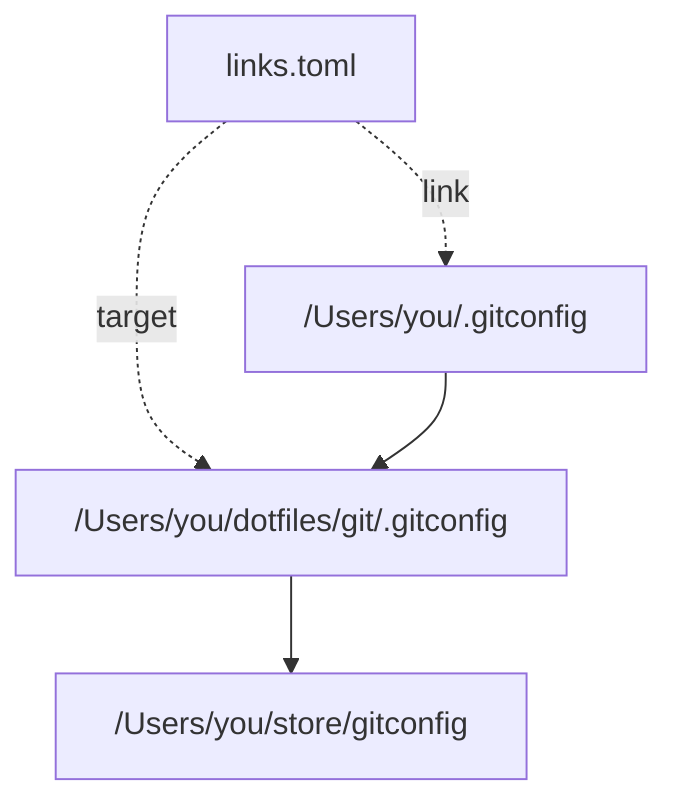

# slink

[English](README.md) | [日本語](README.ja.md)

手編集できる1つの TOML 管理ファイルで、シンボリックリンクを作成・管理する macOS 向け CLI です。

## インストール

```sh
brew install kkensuke/tap/slink
```

または、現在の stable Rust ツールチェーンでソースからビルドします。

```sh
git clone https://github.com/kkensuke/slink.git
cd slink
cargo install --path . --locked
```

成功した macOS CI ジョブからも、リリース用の実行ファイルを Actions artifact として取得できます。利用対象の OS は macOS で、Linux CI は移植可能な処理を検証します。リリースの保守手順は [Homebrew releases](docs/homebrew.md) にあります。

## 最初の操作

両方の引数は作業ディレクトリを基準にします。slink は保存前に絶対パスへ変換します。

```sh
cd /Users/you
slink -p dotfiles/nvim .config/nvim
slink list
slink check
slink fix -n
```

この操作は `/Users/you/.config/nvim` を作成して `/Users/you/dotfiles/nvim` を指すようにし、登録します。`-p` は親ディレクトリ `.config` がなければ作成します。target は作成しません。`.config/nvim` に通常ファイルやディレクトリがある場合は、変更せず競合を報告します。

管理ファイルには次の内容が保存されます。

```toml
version = 2

[[link]]
link = "/Users/you/.config/nvim"
target = "/Users/you/dotfiles/nvim"
```

存在しない target へのリンクは作成でき、その状態を報告します。target に到達できるようになるまで、`check` は問題として報告します。

## コマンド

```sh
slink [options] <target> <link>
slink --config
slink list
slink check [link ...]
slink fix [options] [link ...]
slink remove [options] <link ...>
slink adopt [options] <link ...>
slink scan [options] [directory ...]
```

| コマンド | 役割 |
| --- | --- |
| `slink <target> <link>` | 実物と管理ファイルを CLI の指定に合わせる |
| `slink --config` | ファイルやディレクトリを作らず、管理ファイルの場所を表示する |
| `slink list` | リンクや target の健全性を検査せず、登録内容を表示する |
| `slink check [link ...]` | 登録と実物の参照パスを照合し、target に到達できるか検査する |
| `slink fix [link ...]` | 管理ファイルからリンクを復元する。異なる既存 symlink の変更には `-f` が必要 |
| `slink remove <link ...>` | 登録と一致するリンクを削除し、登録解除する。target は削除しない |
| `slink adopt <link ...>` | 既存 symlink を変更せず、その実物から登録を追加・更新する |
| `slink scan [directory ...]` | 指定ディレクトリ直下のリンクを発見する。省略時は作業ディレクトリを使う |

`check` と `fix` は、リンクを指定しなければ全登録を対象にします。`remove` と `adopt` はリンクの明示指定が必要です。管理ファイルの項目を手で削除した場合は管理解除のみとなり、実物のリンクは削除しません。

### リンク配置先がすでに存在する場合

第2引数は常にリンクそのものの配置先です。target のファイル名を付け足したり、既存の配置先ディレクトリの中にリンクを作ったりしません。

| リンク配置先の実物 | 通常の作成 | `-f` 付きの作成 |
| --- | --- | --- |
| 存在しない | リンクを作成し、登録を追加・更新する | 同じ |
| 参照パスが一致する symlink | symlink を保持し、登録を追加・更新する | 同じ |
| 参照パスが異なる symlink | 競合を報告し、`-f` を案内する | symlink を置換し、登録を追加・更新する |
| 通常ファイル・ディレクトリ・その他の実物 | 競合を報告し、実物を保持する | 同じ |

登録済み・未登録の symlink の両方で使えます。symlink と登録がすでに一致していれば、`UNCHANGED` と表示します。

```sh
slink -f ~/dotfiles/git/.gitconfig ~/.gitconfig
```

新しい target 自体が symlink でも構いません。slink はその参照を保持し、連鎖の最終参照先には置き換えません。

## パス

| 用語 | 意味 |
| --- | --- |
| link | シンボリックリンクを配置する場所 |
| registered target | 管理ファイルに保存した絶対参照パス |
| actual target | 既存 symlink から読み取った文字列。相対パスの場合もある |
| working directory（作業ディレクトリ） | コマンドを実行するディレクトリ |

| 入力・保存値 | ルール |
| --- | --- |
| CLI のすべてのパス | 絶対パス、作業ディレクトリ基準の相対パス、先頭 `~/` を受け付け、絶対パスに変換する |
| 管理ファイルの `link` / `target` | 手編集も含め、絶対パスだけを受け付ける |
| 新規作成・復元する symlink の target | 絶対パス |

`~/` は入力時だけの省略表記です。通常は先にシェルが展開しますが、引用符で囲んだ場合も slink が受け付けます。管理ファイル内の `~`、変数、シェル式は展開しません。管理ファイルの不正な相対パスには、絶対パスの例を添えてエラーを報告します。

余分な `.` は取り除きます。`..` は、その直前のパスが通常ディレクトリだと確認できた場合だけ整理し、symlink・存在しない場所・検査できない場所を通る場合は保持します。target の末尾の `/` や `/.` によるディレクトリ指定も保持します。変換時に target の symlink を最終参照先へ置き換えることはありません。最終的に同じファイルへ到達しても、異なる参照パスは不一致になる場合があります。

例えば、管理ファイルに次の連鎖の最初のリンクを登録し、その target 自体を別の symlink にできます。



### 既存の相対リンクを adopt する場合

`adopt` は既存の相対 target を、リンクが実際に格納されているディレクトリを基準に読み取り、絶対参照パスにして保存します。既存 symlink は書き換えません。symlink から読んだ文字列は OS のデータなので、そこにある文字どおりの `~` は展開しません。

`/Users/you/bin/python3` というリンクが `python` を格納していれば、`adopt` は `/Users/you/bin/python` を registered target として保存します。`check` と `fix` も同じ変換を使って実物と登録を照合します。一致する相対リンクは保持します。リンクが削除された場合、`fix` は絶対 target で復元するため、元の相対表記は保存されません。

```sh
slink adopt ~/bin/python3
slink check ~/bin/python3
slink fix ~/bin/python3
```

## 管理ファイル

`XDG_CONFIG_HOME` が絶対パスなら、管理ファイルは `$XDG_CONFIG_HOME/slink/links.toml` です。未設定・空・`config` や `./config` のような相対パスの場合は、`~/.config/slink/links.toml` を使います。作成または adopt の際、必要なら管理ファイルを初期化します。`scan` は管理ファイルがなくても実行できます。

```sh
slink --config
code "$(slink --config)"
```

1件の登録は、完全な `[[link]]` ブロック1つです。スキーマは version 2 で、各ブロックには `link` と `target` の2項目だけを記述します。両方とも絶対パスが必要です。旧スキーマと、廃止した `--file`・`--relative`・`--replace` は拒否します。`config` は通常のファイル名として扱い、管理ファイルの場所の表示には `--config` を使います。

| 手編集 | 結果 |
| --- | --- |
| 項目を追加 | `fix` で不足するリンクを作成できる |
| `target` を変更 | `fix -f` で異なる既存 symlink を更新できる |
| 項目全体を削除 | リンクは残り、list・check・fix の対象から外れる |
| `link` を変更 | 古いリンクは未登録のまま残り、`fix` で新しいリンクを作成できる |

リンクと登録を両方削除するには、項目が残っている間に `remove` を使います。`remove -k` は実物を残します。手で変更した symlink に既存登録を合わせる場合は `adopt` を使います。

CLI による編集は、コメント・順序・改行形式を保持し、無関係な値を変更しません。管理ファイル自体が symlink の場合は、参照先の通常ファイルを更新し、管理ファイルの symlink は保持します。

## オプション

| 短縮形 | 長い形式 | 対象 |
| --- | --- | --- |
| `-c` | `--config` | 管理ファイルの場所だけを表示 |
| `-f` | `--force` | 作成・fix：異なる symlink を置換 |
| `-p` | `--parents` | 作成・fix：不足するリンクの親ディレクトリを作成 |
| `-n` | `--dry-run` | 変更コマンド：書き込まず変更予定を表示 |
| `-k` | `--keep-link` | remove：登録だけを解除 |
| `-R` | `--recursive` | scan：通常のサブディレクトリを再帰探索 |
| `-o` | `--format <human\|tsv>` | list・check・scan：出力形式 |
| `-h` | `--help` | ヘルプ |
| `-V` | `--version` | バージョン |

短縮形は `-np` のように連結できます。出力形式は `-o tsv`・`-otsv`・`--format tsv`・`--format=tsv` を受け付けます。情報表示オプション（`--config`・`--help`・`--version`）は単独で使います。不正な組合せは、変更を行う前に拒否します。

`--` はオプション名・コマンド名の解析を終了します。

```sh
slink -- list ./list-link
slink check -- -link
```

最初のコマンドは、作業ディレクトリにある `list` というファイルを target にします。2つ目は、`-link` という名前の登録済みリンクを検査します。`./list-link` のような通常のパスは、コマンドの後に `--` を付ける必要がありません。

親の作成・置換・dry-run・削除時のリンク保持・再帰探索は明示指定です。新規リンクは常に登録し、存在しない target も許可して報告します。管理ファイルにコマンドのオプションは保存しません。[デフォルトの判断](docs/defaults.md)も参照してください。

## scan と出力

```sh
slink scan
slink scan -R ~/github
slink scan ~/Library/Services
slink list -o tsv
slink check -o tsv
```

scan は `-R` がなければ直下だけを探索します。再帰探索では `.venv` や `.workflow` バンドルのような通常ディレクトリも対象です。ディレクトリへの symlink は表示しますが、中へは入りません。探索開始パスそのものが symlink の場合は、末尾に `/` を付けた場合も拒否します。重複する開始パスや親子の開始パスを指定しても、同じリンクを重複表示しません。

管理状態はリンクの配置先で決まります。`~/Library/Services` のリンクを登録しても、その target がある `~/github` のディレクトリ内のリンクは自動登録されません。そのため、`check` が全登録を正常と報告していても、`scan` が workflow 内に別の未管理リンクを発見する場合があります。

human 出力では、scan の結果を管理中・未管理に分け、それぞれ問題のあるリンクを先に表示します。正常な `check` は `OK N links` だけを表示します。ホームディレクトリ内のリンク配置先は `~/…` に省略表示する場合がありますが、管理ファイルの値は絶対パスです。target は引用符で囲み、制御文字をエスケープします。色は端末への出力時だけ有効で、`NO_COLOR` または `TERM=dumb` で無効にできます。

TSV はヘッダー付きの1リンク1行です。

| コマンド | 列の順序 |
| --- | --- |
| list | `LINK`, `TARGET` |
| check | `LINK_STATE`, `TARGET_STATE`, `LINK`, `TARGET`, `ACTUAL_TARGET_STATE`, `ACTUAL_TARGET` |
| scan | `MANAGEMENT`, `TARGET_STATE`, `LINK`, `TARGET`, `LINK_STATE`, `EXPECTED_TARGET_STATE`, `EXPECTED_TARGET` |

パス・target のセルは JSON 文字列、値がない任意セルは空欄とし、診断の理由は stderr に出します。check の `TARGET` は登録済みの絶対 target、`ACTUAL_TARGET` は実物から読んだ文字列です。scan の `TARGET` は実物の文字列、`EXPECTED_TARGET` は登録済みの絶対 target です。そのため、adopt した一致するリンクでも、これらの列の文字列が異なる場合があります。

## 保護と復旧

force が置換するのは symlink だけです。remove が削除するのは登録と一致する symlink だけで、target は削除しません。作成・復元時の直接の自己参照は拒否します。管理するリンク配置先の親子関係と、管理ファイルや制御ファイルに重なる配置先には対応しません。パスと target の文字列は正しい UTF-8 である必要があります。

変更操作は管理ファイルをロックし、同時編集を検出して、原子的に保存します。ファイルシステムの変更計画は dry-run と共有します。作成・削除・置換が中断した場合は、同じコマンドを同じ target・オプションで再実行すると復旧します。`check` は未完了の復旧を報告します。別のコマンドが未完了操作を引き継ぐことはできません。

管理ファイルの隣に `.slink-lock`・`.slink-pending`、置換・削除時には一時的な `.slink-*` 復旧ディレクトリが残る場合があります。復旧完了まで保持してください。複数項目の処理では、後の項目が失敗しても完了済みの項目は保持します。バッチ全体の原子性や、電源断に対する無条件の保証はありません。

## 終了コード

| コード | 意味 |
| --- | --- |
| 0 | 操作が完了。check では選択した全項目が正常 |
| 1 | check の問題検出、項目の失敗・競合、scan の検査不能 |
| 2 | 引数・管理ファイルの不正、管理ファイルの利用不能、復旧の中断 |

作成・fix が成功すれば、target 不在でも0を返し、check はその不在に1を返します。scan は権限・I/O エラーには1を返しますが、不在・解決不能の target を発見しただけでは失敗にしません。`-f` のない fix で異なる symlink が未修復のまま残った場合は1を返します。

stdout のパイプ先が閉じた場合は、panic を起こさず以後の出力を止め、操作本来の終了コードを返します。それ以外の stdout 書き込みエラーは2を返します。

## 開発

```sh
cargo fmt --check
cargo clippy --locked --all-targets -- -D warnings
cargo test --locked
cargo build --locked --release
```

統合テストは、ホーム・設定ディレクトリを隔離して実行ファイルを動かします。中断・復旧、参照パス、管理ファイルの編集、出力、scan の深さを検証します。macOS CI では、大文字・小文字を区別する APFS と区別しない APFS も検証します。失敗注入は debug ビルドにだけ組み込み、release 実行ファイルはテスト用のクラッシュ変数を無視します。
