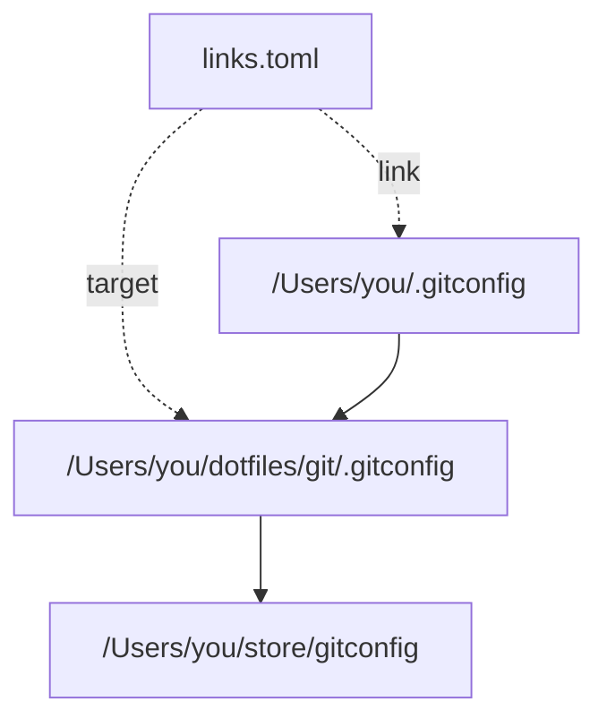

# slink

[English](README.md) | [日本語](README.ja.md)

A macOS CLI for creating and managing symbolic links with one hand-editable TOML registry.

## Install

```sh
brew install kkensuke/tap/slink
```

Or build from source with a current stable Rust toolchain:

```sh
git clone https://github.com/kkensuke/slink.git
cd slink
cargo install --path . --locked
```

Successful macOS CI jobs also provide a release executable as an Actions artifact. macOS is the supported user platform; Linux CI tests the portable logic. Release maintenance is described in [Homebrew releases](docs/homebrew.md).

## Quick start

Both operands start from your working directory. slink converts them to absolute paths before storing them.

```sh
cd /Users/you
slink -p dotfiles/nvim .config/nvim
slink list
slink check
slink fix -n
```

This creates `/Users/you/.config/nvim`, pointing to `/Users/you/dotfiles/nvim`, and registers it. `-p` creates the missing parent directory `.config`; it does not create the target. A regular file or directory already at `.config/nvim` is left untouched and reported as a conflict.

The registry contains:

```toml
[[link]]
link = "/Users/you/.config/nvim"
target = "/Users/you/dotfiles/nvim"
```

Missing targets are allowed and reported. `check` returns a problem until the target becomes reachable.

## Commands

```sh
slink [options] <target> <link>
slink --config
slink list
slink check [link ...]
slink fix [options] [link ...]
slink remove [options] <link ...>
slink adopt [options] <link ...>
slink scan [options] [directory ...]
```

| Command | Responsibility |
| --- | --- |
| `slink <target> <link>` | Make the link and registry agree with the CLI arguments |
| `slink --config` | Print the registry path without creating a file or directory |
| `slink list` | Display the stored link and target strings without path validation or filesystem inspection |
| `slink check [link ...]` | Validate registry paths, compare registered and actual references, and check target availability |
| `slink fix [link ...]` | Restore links from the registry; changing an existing different symlink requires `-f` |
| `slink remove <link ...>` | Delete matching registered links and unregister them; never delete their targets |
| `slink adopt <link ...>` | Add or update registrations from existing symlinks without changing those symlinks |
| `slink scan [directory ...]` | Discover links directly inside the directories; default directory is the working directory |

`check` and `fix` select all registrations if no link is specified. `remove` and `adopt` require explicit link paths. Deleting a registry entry by hand only unregisters the link; it does not delete the actual link.

### Existing link locations

The second operand is always the exact location of the link. slink never appends the target's filename or creates a link inside an existing destination directory.

| Object at the link location | Normal creation | Creation with `-f` |
| --- | --- | --- |
| Nothing | Create the link; add or update its registration | Same |
| A symlink with a matching reference path | Keep the symlink; add or update its registration | Same |
| A symlink with a different reference path | Report a conflict and suggest `-f` | Replace the symlink; add or update its registration |
| A regular file, directory, or other filesystem object | Report a conflict and preserve it | Same |

This works for both registered and unregistered symlinks. When the symlink and registration already match, the command reports `UNCHANGED`.

```sh
slink -f ~/dotfiles/git/.gitconfig ~/.gitconfig
```

Here the new target can itself be a symlink. slink keeps that reference instead of replacing it with the chain's final destination.

## Paths

| Term | Meaning |
| --- | --- |
| link | The location at which a symbolic link is placed |
| registered target | The absolute reference path saved in the registry |
| actual target | The text read from the existing symlink; this can be relative |
| working directory | The directory in which the command runs |

| Input or stored value | Rule |
| --- | --- |
| Every CLI path | Absolute paths, working-directory-relative paths, and leading `~/` are accepted and converted to absolute paths |
| Registry `link` and `target` | Absolute paths only, including hand edits |
| Newly created or restored symlink target | Absolute path |

`~/` is an input abbreviation only. The shell normally expands it first; slink also accepts it when quoted. The registry does not expand `~`, variables, or shell expressions.

During path conversion, redundant `.` components are removed. A `..` component is simplified only when its preceding path is known to be an ordinary directory; symlink, missing, or inaccessible components are preserved. Target suffixes such as `/` and `/.` retain their directory requirement. Target symlinks are never replaced with their final destinations during conversion. Distinct reference paths can remain different even when they eventually reach the same file.

For example, a registry can record the first link in this chain while the target is itself another symlink:



### Adopting relative symlinks

`adopt` reads an existing relative target from the directory that physically contains the link, converts that reference to an absolute path, and saves it. The existing symlink is not rewritten. Text read from a symlink is OS data, so a literal `~` there is not expanded.

For a link `/Users/you/bin/python3` containing `python`, `adopt` saves `/Users/you/bin/python` as the registered target. `check` and `fix` use the same conversion to compare the actual and registered targets. A matching relative link stays as it is. If the link is removed, `fix` restores it with an absolute target; the original relative spelling is not preserved.

```sh
slink adopt ~/bin/python3
slink check ~/bin/python3
slink fix ~/bin/python3
```

## Registry file

The registry is `$XDG_CONFIG_HOME/slink/links.toml` when `XDG_CONFIG_HOME` is an absolute path. If it is unset, empty, or relative, such as `config` or `./config`, slink uses `~/.config/slink/links.toml`. Creation or adoption initializes the registry when needed. `scan` can run before it exists.

```sh
slink --config
code "$(slink --config)"
```

One registration is one complete `[[link]]` block, with exactly two string fields: `link` and `target`. Both values must be absolute paths. There is no `version` field or other top-level setting. An empty file represents no registrations.

`list` displays entries in file order, including invalid paths and duplicate registrations. For example, a hand-edited `target = "PhD"` remains visible in the list. `check`, `scan`, and mutation commands validate the entire registry before inspecting or changing links; they reject that target because it is not absolute. Path errors identify the registry file, entry number, and invalid field without guessing what path you intended.

All commands that read registrations, including `list`, require valid TOML and the entry structure above. A syntax error, missing field, non-string value, or unknown field prevents the file from being read; no partial list is printed.

| Hand edit | Effect |
| --- | --- |
| Add an entry | `fix` can create the missing link |
| Change `target` | `fix -f` can update an existing different symlink |
| Delete the whole entry | The link remains and is no longer included in list, check, or fix |
| Change `link` | The old link remains unregistered; `fix` can create the new link |

To delete a link and its registration, use `remove` while the entry still exists. `remove -k` leaves the actual link in place. `adopt` updates an existing registration to match a manually changed symlink.

CLI edits preserve comments, ordering, and line endings, and leave unrelated values unchanged. If the registry file is a symlink, slink updates its referenced regular file and preserves the registry symlink.

## Options

| Short | Long | Applies to |
| --- | --- | --- |
| `-c` | `--config` | Print the registry path only |
| `-f` | `--force` | Create/fix: replace different symlinks |
| `-p` | `--parents` | Create/fix: create missing link parent directories |
| `-n` | `--dry-run` | Mutation commands: preview without writing |
| `-k` | `--keep-link` | Remove: unregister only |
| `-R` | `--recursive` | Scan: recurse into ordinary subdirectories |
| `-o` | `--format <human\|tsv>` | List/check/scan: output format |
| `-h` | `--help` | Help |
| `-V` | `--version` | Version |

Short flags can be combined, such as `-np`. Formats accept `-o tsv`, `-otsv`, `--format tsv`, or `--format=tsv`. Information options (`--config`, `--help`, `--version`) must be used on their own. Invalid combinations are rejected before any changes.

`--` ends option and command-name parsing:

```sh
slink -- list ./list-link
slink check -- -link
```

The first command uses the file `list` in the working directory as its target. The second checks the registered link named `-link`. Ordinary paths such as `./list-link` do not need `--` after a command.

Parent creation, replacement, dry-run, keeping removed links, and recursive scanning are opt-in. Newly created links are always registered; missing targets are allowed and reported. No command options are stored in the registry. See [default decisions](docs/defaults.md).

## Scan and output

```sh
slink scan
slink scan -R ~/github
slink scan ~/Library/Services
slink list -o tsv
slink check -o tsv
```

Scan is shallow unless `-R` is specified. Recursive scans include ordinary directories such as `.venv` and `.workflow` bundles. Directory symlinks are displayed but never traversed. A scan root that is itself a symlink is rejected, including when written with a trailing slash. Duplicate or overlapping roots do not duplicate links.

Management is determined by the link's location. A registered link in `~/Library/Services` does not register links found inside its target directory under `~/github`. `check` can therefore report all registrations healthy while `scan` discovers other unmanaged links inside a workflow.

Human output groups scan results into managed and unmanaged links, with problems first. A healthy `check` prints only `OK N links`. Human link locations under the home directory may display as `~/…`; registry values stay absolute. Targets are quoted and control characters escaped. Colors are enabled only on a terminal, and disabled by `NO_COLOR` or `TERM=dumb`.

TSV has a header and one row per link:

| Command | Columns in order |
| --- | --- |
| list | `LINK`, `TARGET` |
| check | `LINK_STATE`, `TARGET_STATE`, `LINK`, `TARGET`, `ACTUAL_TARGET_STATE`, `ACTUAL_TARGET` |
| scan | `MANAGEMENT`, `TARGET_STATE`, `LINK`, `TARGET`, `LINK_STATE`, `EXPECTED_TARGET_STATE`, `EXPECTED_TARGET` |

Path/target cells are JSON strings, optional absent cells are empty, and diagnostic reasons go to stderr. For list, both columns contain the stored strings without path conversion. For check, `TARGET` is the registered absolute target and `ACTUAL_TARGET` is the text read from the link. For scan, `TARGET` is the actual text and `EXPECTED_TARGET` is the registered absolute target. Thus a matching adopted link can have different text in those columns.

## Safety and recovery

Force replaces symlinks only. Remove deletes matching registered symlinks only, and never deletes their targets. Direct self-references are rejected during creation/restoration. Nested managed link locations and destinations overlapping the registry or its control files are unsupported. Paths and target text must be valid UTF-8.

Mutations lock the registry, detect concurrent edits, and save it atomically. Filesystem changes share a plan with dry-run. If creation, removal, or replacement is interrupted, repeating the same command with the same target and options resumes the operation. `check` reports pending recovery. A different command cannot take over an incomplete operation.

The registry can have adjacent `.slink-lock` and `.slink-pending` files, and replacement/removal can leave temporary `.slink-*` recovery directories. Preserve these until recovery completes. Completed batch items remain completed if another item fails; there is no whole-batch atomicity or unconditional power-loss guarantee.

## Exit codes

| Code | Meaning |
| --- | --- |
| 0 | The operation completed; check found all selected entries healthy |
| 1 | Check found a problem, an item failed/conflicted, or scan could not complete an inspection |
| 2 | Invalid arguments/registry, unavailable registry, or blocked recovery |

`list` returns 0 when it can read and display the entries, even if their paths are invalid. This does not mean the registry or links passed a check. `check` returns 2 for invalid registry values, and 1 for problems with the actual links or their targets.

Successful creation/fix returns 0 even with a missing target; check returns 1 for it. Scan returns 1 for permission/I/O failures, but does not fail merely because it discovers missing or unresolvable targets. Fix without `-f` returns 1 if a different symlink remains unrepaired.

A closed stdout pipe stops further output without a panic; the operation keeps its normal exit status. Other stdout write errors return 2.

## Development

```sh
cargo fmt --check
cargo clippy --locked --all-targets -- -D warnings
cargo test --locked
cargo build --locked --release
```

Integration tests run the executable with an isolated home and config directory. They cover interruption/recovery, path references, registry edits, output, and scan depth. macOS CI also verifies case-sensitive and case-insensitive APFS. Failure injection is compiled only into debug builds; release executables ignore the test crash variable.
