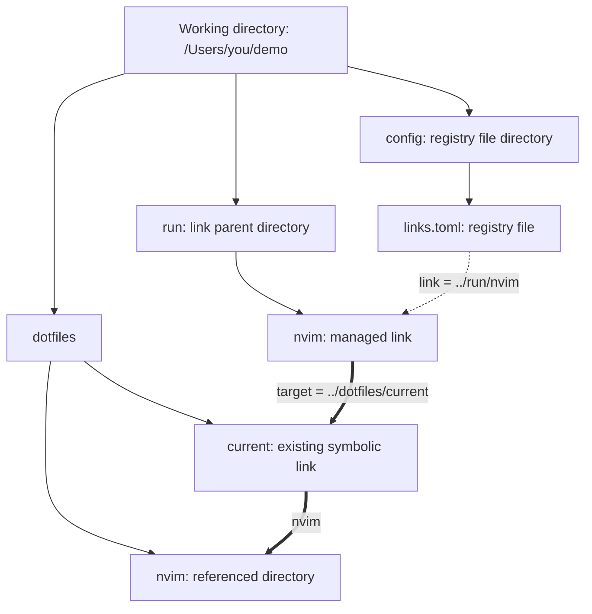

# slink

A macOS CLI for managing symbolic links. Create links, record their intended targets in a hand-editable TOML file, and inspect, restore, or remove them later.

## Install

With a current stable Rust toolchain:

```sh
git clone https://github.com/kkensuke/slink.git
cd slink
cargo install --path . --locked
```

Successful macOS CI jobs also provide a release executable as an Actions artifact. The supported user platform is macOS; Linux CI exercises the portable logic.

## Path model

A symbolic link stores a path as text. In slink, `link` specifies **where the symbolic link is placed**, and `target` specifies **the path text stored inside that link**. The path in `target` may name a file, a directory, or another symbolic link.

The **working directory** is the directory in which you run a command. `pwd -P` displays its physical path. The **registry file** is the TOML file containing slink's registrations; its location is selected with `--file` or the default described below. The **registry file directory** is the directory containing that selected file. The **link parent directory** is the directory containing the symbolic link.

This example uses `/Users/you/demo` as the working directory and `/Users/you/demo/config/links.toml` as the registry file. The parent directories shown are ordinary directories. `dotfiles/current` is an existing symbolic link containing the text `nvim`, which leads to the directory `dotfiles/nvim`.

The registry file contains:

```toml
version = 1

[[links]]
link = "../run/nvim"
target = "../dotfiles/current"
```

The diagram shows the link described by that entry. Thin solid lines show directory contents; the dotted line associates the entry with its link; thick arrows show symbolic-link references.



| Term | Concrete value in the diagram |
| --- | --- |
| Working directory | `/Users/you/demo` |
| Registry file | `/Users/you/demo/config/links.toml` |
| Registry file directory | `/Users/you/demo/config` |
| Link path (`link`) | `/Users/you/demo/run/nvim`, obtained from `../run/nvim` in the registry file |
| Link parent directory | `/Users/you/demo/run` |
| Stored target text (`target`) | `../dotfiles/current` |
| Existing symbolic link named by that target | `/Users/you/demo/dotfiles/current` |
| Directory reached after following both symbolic links | `/Users/you/demo/dotfiles/nvim` |

`readlink /Users/you/demo/run/nvim` returns `../dotfiles/current`. It does not return the final directory's path. slink manages `run/nvim`; referring to `dotfiles/current` does not automatically register or change that existing link. `link` and `target` describe roles in one reference, so a target can itself be another symbolic link.

### Where relative paths start

An absolute path starts with `/`, such as `/Users/you/demo/run/nvim`. A relative path, such as `run/nvim` or `../run/nvim`, needs a starting directory. In the example above:

| Input | Starting directory / rule | Result |
| --- | --- | --- |
| CLI `--file config/links.toml` | Working directory | `/Users/you/demo/config/links.toml` |
| CLI link argument `run/nvim` | Working directory | `/Users/you/demo/run/nvim` |
| Registry `link = "../run/nvim"` | Registry file directory | `/Users/you/demo/run/nvim` |
| Registry `target = "../dotfiles/current"` | Link parent directory when the link is followed | `/Users/you/demo/dotfiles/current` |
| CLI target argument `dotfiles/current`, without `--relative` | Stored unchanged; followed from the link parent directory | `/Users/you/demo/run/dotfiles/current` |
| CLI target argument `dotfiles/current`, with `--relative` | Locate the supplied path from the working directory, then store a path from the link parent directory | Stores `../dotfiles/current`, referring to `/Users/you/demo/dotfiles/current` |

For example, the registry entry's target is interpreted from `/Users/you/demo/run`: go up one directory with `..`, then enter `dotfiles/current`. A relative target uses the link parent directory because that is how the operating system follows symbolic links. The registry file's location is not involved when the operating system follows the link.

## Commands

These are independent usage examples:

```sh
slink ~/dotfiles/zshrc ~/.zshrc
slink --relative --parents ~/dotfiles/nvim ~/.config/nvim
slink list
slink check
slink fix --dry-run
slink fix --parents
slink fix --replace ~/.zshrc
slink remove ~/.zshrc
slink remove --keep-link ~/.config/nvim
slink adopt ~/.gitconfig ~/.tmux.conf
slink scan ~/.config
```

| Command | Responsibility |
| --- | --- |
| `slink <target> <link>` | Create a symbolic link and add its `link` / `target` entry to the registry file |
| `slink list` | Display registered entries without inspecting their links |
| `slink check [link ...]` | Check registered links against their stored target text and report target availability |
| `slink fix [link ...]` | Restore missing links; replace mismatched links only with `--replace` |
| `slink remove <link ...>` | Delete matching registered links and their entries; preserve the files or directories they point to |
| `slink adopt <link ...>` | Add entries for existing symbolic links without changing those links |
| `slink scan <directory ...>` | Discover symbolic links without registering them |

`check` and `fix` default to all entries in the selected registry file. `remove` and `adopt` require explicit link paths. `scan` recurses into ordinary directories and never follows symbolic links to directories; its starting directories must also be ordinary directories.

### If the link path already exists

In `slink --relative --parents ~/dotfiles/nvim ~/.config/nvim`, the exact link path is `~/.config/nvim`. `--parents` can create the parent `~/.config` if it is missing. It does not turn an existing `~/.config/nvim` directory into a link, and it does not create another link inside that directory.

| What is at `~/.config/nvim`? | Result of that creation command |
| --- | --- |
| Nothing, and the path is not registered | Create and register the link |
| An ordinary directory, even an empty one | Error; leave the directory and its contents unchanged |
| An ordinary file | Error; leave the file unchanged |
| An unregistered symbolic link, including one pointing to a directory | Error; use `slink adopt ~/.config/nvim` to register the existing link |
| A registered symbolic link whose registered and actual target text both match the command's target text | Report `UNCHANGED`; succeed without recreating it |
| A registered path in any other state | Error; inspect it with `check` and use `fix` as appropriate |

Target text is compared exactly. Two different strings that happen to reach the same file are still different targets for this comparison. Neither `--parents` nor `fix --replace` authorizes overwriting an ordinary directory.

### What `--` means

`--` ends option parsing: the remaining arguments are literal paths. Before the first path of a creation command, it also prevents that path from being interpreted as a subcommand name.

| Example | Meaning |
| --- | --- |
| `slink -- list ./list-link` | Create `./list-link` with the literal target `list`; here `list` is a path, not the list subcommand |
| `slink check ./list-link` | Check only the registered link at `./list-link` |
| `slink check -- ./list-link` | The same check; `--` is optional because this path does not begin with `-` |
| `slink check -- -link` | Check the registered link named `-link`; `--` prevents it from being treated as an option |

Here `./list-link` means `list-link` in the working directory. `check` does not create or register it.

## Registry file

### Selecting a file

The default is `$XDG_CONFIG_HOME/slink/links.toml` when `XDG_CONFIG_HOME` contains an absolute path, for example `/Users/you/config`. If the variable is unset, empty, or contains a relative path such as `config` or `./config`, slink uses `~/.config/slink/links.toml` instead. Here “relative” describes the environment variable's path value; it is unrelated to the `--relative` option.

`--file` selects exactly one other registry file. Files are never merged or auto-discovered. A relative `--file` path starts from the working directory:

```sh
cd /Users/you/demo
slink --file config/links.toml check
```

This selects `/Users/you/demo/config/links.toml`, so its registry file directory is `/Users/you/demo/config`.

### Why registry `link` paths can be relative

A hand-written project registry can use `link = "../run/nvim"`, as in the diagram. Basing this on the registry file directory makes it name the same link regardless of which working directory you run slink from. Moving the project tree together preserves the relationship between that registry file and the link path.

Relative `link` paths are optional. For a personal registry, `~/...` or absolute paths may be easier to read. CLI creation and `adopt` write absolute `link` paths automatically. When other entries change, slink preserves hand-written path spelling, comments, ordering, quote styles, and CRLF line endings.

### `~`, variables, and shell expansion

In a command such as `ln -s ~/dotfiles/nvim ~/.config/nvim`, the shell expands `~` **before** it starts `ln`. The same expansion happens before `slink` starts:

```sh
slink ~/dotfiles/nvim ~/.config/nvim
slink "$HOME/dotfiles/nvim" "$HOME/.config/nvim"
```

Both pass expanded home-directory paths to slink. These are alternative spellings, not steps to run in sequence. If you single-quote the target, the shell does not expand it:

```sh
ln -s '~/dotfiles/nvim' ./nvim-link
slink '~/dotfiles/nvim' ./nvim-link
```

These are also alternatives. Both store the literal text `~/dotfiles/nvim`. Following such a link treats `~` as a directory name inside the link parent directory, not as your home directory.

A TOML file is data and is not evaluated by a shell. slink provides one explicit convenience: a registry `link` value beginning with `~/` is expanded to the user's home directory. It does not expand variables or shell expressions in either field. Registry `target` values are kept as the exact text to store in the symbolic link, so `~` is not expanded there either. This lets `adopt` record an existing link's text and `fix` reproduce it without changing its meaning.

For example, assuming the home directory is `/Users/you`, this entry places a link at `/Users/you/.config/nvim` and refers to `/Users/you/dotfiles/nvim`:

```toml
version = 1

[[links]]
link = "~/.config/nvim"
target = "../dotfiles/nvim"
```

For the same location, `target = "/Users/you/dotfiles/nvim"` is also valid. `target = "~/dotfiles/nvim"` does not mean that absolute home-directory path.

### Editing entries by hand

An entry is one complete `[[links]]` block with its `link` and `target` fields. “Registered” means that such an entry exists in the selected registry file; there is no separate list of formerly registered links.

| Hand edit | Effect |
| --- | --- |
| Add an entry | `fix` can create its missing link |
| Change an entry's `target` | An existing mismatched link is changed only by `fix --replace` |
| Delete an entire entry | The actual link remains, but this registry file's `list`, `check`, and `fix` no longer include it |
| Change an entry's `link` | The old link remains and is no longer registered at that path; `fix` can create a link at the new path |

Deleting one entry means removing its `[[links]]` header and both fields, not deleting only `link` or `target`, which would leave an invalid entry. For example, after deleting the only entry for `~/.config/nvim`, that link still works as before, but `slink fix` will no longer restore it if it later disappears.

To delete a link as well as its entry, run `slink remove <link>` **while the entry is still present**. Its target file or directory remains. `slink remove --keep-link <link>` deletes only the entry. If you already deleted the entry by hand, slink treats the remaining link as unregistered; `remove` will not delete it unless you register it again with `adopt`.

### If the registry file is itself a symbolic link

slink updates the ordinary file it points to and keeps the registry file's symbolic link in place. Relative `link` values still start from the directory of the **selected registry file path**.

For example, if you select `/Users/you/demo/config/links.toml` and that file is a symbolic link to `/Users/you/store/shared.toml`, `link = "../run/nvim"` still names `/Users/you/demo/run/nvim`. The starting directory remains `/Users/you/demo/config`.

This allows the stored TOML data to live elsewhere while the selected file path determines the project location. Selecting the same data through a file path in a different directory can change what relative `link` values name. Use absolute or `~/...` `link` values if their meaning should not depend on the selected registry file path.

## Options and defaults

### `--relative`

The **target argument** is the path supplied in `slink <target> <link>`, after any shell expansion. Without `--relative`, slink stores this argument unchanged, like `ln -s`. If it is relative, the operating system follows it from the link parent directory.

With `--relative`, slink first interprets the target argument from the working directory, then computes the target text relative to the link parent directory. As an alternative to writing the diagram's registry entry by hand, creating the link from the CLI looks like this:

```sh
cd /Users/you/demo
slink --file config/links.toml --relative --parents dotfiles/current run/nvim
```

The target argument is `dotfiles/current`; the stored target text is `../dotfiles/current`. The CLI writes an absolute `link` value, `/Users/you/demo/run/nvim`, which names the same link as the hand-written `../run/nvim` in the diagram.

If the supplied target path names or passes through another symbolic link, slink keeps that reference in the stored target text. In the diagram, it keeps `current` instead of substituting the final directory `nvim`. If that existing `current` link is later changed to point elsewhere, the managed link follows the new reference too.

Likewise, `..` cannot always be simplified as text. Suppose `alias` is an existing symbolic link to `tree/child`. From the same working directory:

```sh
slink --relative --parents alias/../data run/data
```

The stored target is `../alias/../data`. Following it goes through `alias` into `tree/child`, then up to `tree/data`. Replacing `alias/../data` with `data` would reach a different path. slink keeps this traversal intact. When calculating a relative target, it also accounts for symbolic links in the link's parent directories so that the calculation starts from their actual location.

`--relative` is optional because automatic conversion would change the interpretation of a relative target argument. Relative targets can keep working when the containing source/link tree is moved together, but moving only the link can break them.

### `--parents`

`--parents` creates missing link parent directories during creation or `fix`. It does not create the files or directories named by `target`. It is optional so a mistyped link parent directory is reported instead of silently created. Removing a link leaves its parent directories in place. If those parents are later deleted, restoring them requires `fix --parents` again.

No `relative` or `parents` settings are stored in the registry file. `--relative` determines the target text saved in `target`; `--parents` applies only to the current command. `fix` uses the saved target text without converting it again.

### Other options and built-in behavior

`--dry-run` works for creation, `fix`, `remove`, and `adopt`, and makes no writes, including lock files, recovery records, or parent directories. Batch previews account for earlier planned registrations/removals. Recovery previews check registry edits and destination conflicts before showing a plan.

`--keep-link` works only with `remove`; `--replace` works only with `fix`. `--relative` works only with creation, and `--parents` works only with creation or `fix`. Invalid option combinations are errors.

Automatic registration of newly created links, preservation of TOML formatting, protection of ordinary files/directories, and allowing and reporting missing targets are always enabled. See [the default-behavior decisions](docs/defaults.md) for the tradeoffs.

## Safety and recovery

Missing targets are allowed and reported. Ordinary files/directories are never overwritten by `fix --replace` or deleted by `remove`. An unregistered existing symbolic link must be adopted first. A changed registered link must be explicitly replaced or unregistered with `--keep-link`.

The selected registry file, its control files, and their parent paths cannot themselves be managed link paths. Select a registry file elsewhere with `--file` if you need to manage a directory that would contain it.

Mutation commands use a registry lock and compare registry file contents again before saving. They retain a small operation record if a creation/registration, removal, or replacement is interrupted. Repeat the operation for the failed link with the same target and options to resume. `check` identifies the pending link; for a partly completed removal batch, omit paths already unregistered by earlier items. Unrelated mutations stop until recovery is resolved. Recovery rechecks the actual files and does not overwrite a conflicting manual edit.

Replacement/removal stages the old link in a private directory beside its original location, verifies its identity, and deletes only that verified symbolic link. Unexpected objects are preserved. Replacement may briefly leave the link name absent.

A registry file can have adjacent control files named with `.slink-lock` and, while an operation is incomplete, `.slink-pending` suffixes; for example, `links.toml.slink-pending`. Do not delete pending files or `.slink-*` recovery directories before resolving an interrupted operation. Locks coordinate slink processes, not arbitrary editors. There is no whole-batch atomicity or unconditional power-loss guarantee; completed items are retained when a later item fails.

Supported paths and target text must be UTF-8. Nested managed link paths are unsupported, and ambiguous spellings of link paths are rejected conservatively. A missing parent path containing `..` must be resolved explicitly rather than guessed. Filesystem operations that cannot provide the required exclusive behavior fail rather than falling back to overwriting existing paths.

## Exit codes

| Code | Meaning |
| --- | --- |
| 0 | Requested operation completed; for `check`, all selected entries are healthy |
| 1 | `check` found a problem, an item failed/conflicted, or traversal was incomplete |
| 2 | Invalid arguments/registry file, unavailable registry file, or a blocking recovery error |

Creating or fixing a link successfully returns 0 even if its target is missing. `check` returns 1 for that target. `scan` does not fail merely for finding a broken link. A mismatched link left unrepaired by normal `fix` returns 1.

## Development

```sh
cargo fmt --check
cargo clippy --locked --all-targets -- -D warnings
cargo test --locked
cargo build --locked --release
```

Integration tests run the real executable with isolated registry files and include abrupt interruption/recovery at each mutation stage. Failure injection is only compiled into debug builds; release executables ignore the test crash variable.
