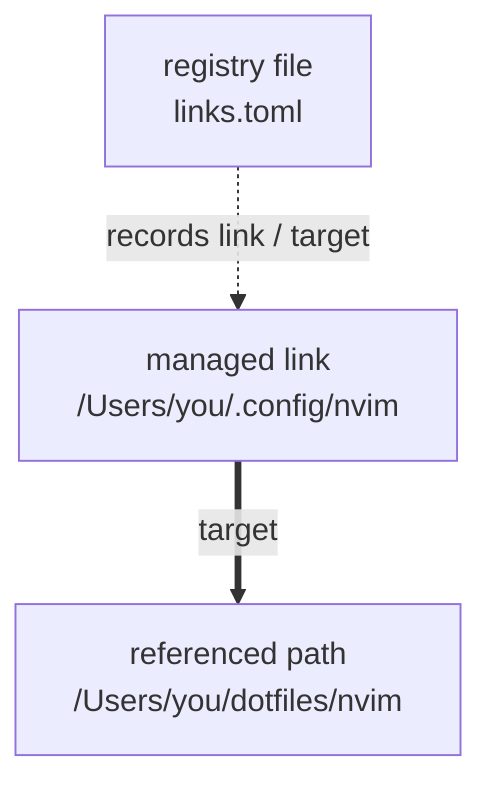

# slink

[English](README.md) | [日本語](README.ja.md)

A macOS CLI for managing symbolic links. It creates links, records them in a hand-editable TOML file, and lets you inspect, restore, or remove them later.

## Install

With a current stable Rust toolchain:

```sh
git clone https://github.com/kkensuke/slink.git
cd slink
cargo install --path . --locked
```

Successful macOS CI jobs also provide a release executable as an Actions artifact. The supported user platform is macOS; Linux CI exercises the portable logic.

## Quick start

`slink <target> <link>` creates a symbolic link and registers it in the registry file at the same time. Absolute paths are the easiest way to understand the basic behavior.

For example, to use `/Users/you/dotfiles/nvim` at `/Users/you/.config/nvim`, run:

```sh
slink --parents /Users/you/dotfiles/nvim /Users/you/.config/nvim
```

This creates the symbolic link `/Users/you/.config/nvim`, pointing to `/Users/you/dotfiles/nvim`. `--parents` creates the link parent directory `/Users/you/.config` if it is missing. If an ordinary file or directory already exists at `/Users/you/.config/nvim`, slink does not overwrite it.



`links.toml` is the default file name shown in the diagram. It is not fixed: `--file` can select any file name and location. See [Selecting a file](#selecting-a-file) below for the default location.

The registry file contains roughly:

```toml
version = 1

[[links]]
link = "/Users/you/.config/nvim"
target = "/Users/you/dotfiles/nvim"
```

You can then inspect the registrations and check or preview restoration:

```sh
slink list
slink check
slink fix --dry-run
```

If you want to store a relative target instead, use `--relative`; for example, the same relationship can be stored as `../dotfiles/nvim`. See [Path model](#path-model) and [`--relative`](#--relative) below for relative-path rules and for hand-written project registries with relative `link` values.

## Commands

```sh
slink <target> <link>
slink list
slink check [link ...]
slink fix [--parents] [--replace] [link ...]
slink remove [--keep-link] <link ...>
slink adopt <link ...>
slink scan <directory ...>
```

| Command | Responsibility |
| --- | --- |
| `slink <target> <link>` | Create a symbolic link and add its `link` / `target` entry to the registry file |
| `slink list` | Display registered entries without inspecting the actual links |
| `slink check [link ...]` | Check registered links against their stored target text and report target availability |
| `slink fix [link ...]` | Restore missing links; replacing a mismatched link requires `--replace` |
| `slink remove <link ...>` | Delete matching registered links and their entries without deleting their targets |
| `slink adopt <link ...>` | Register existing symbolic links without changing them |
| `slink scan <directory ...>` | Discover symbolic links under the selected directories without registering them |

`check` and `fix` use all entries in the selected registry file when no link is specified. `remove` and `adopt` require explicit link paths. `scan` recurses into ordinary directories and does not follow symbolic links to directories.

### If the link path already exists

For example, the exact link path in this command is `/Users/you/.config/nvim`:

```sh
slink --parents /Users/you/dotfiles/nvim /Users/you/.config/nvim
```

| What is at the link path? | Result |
| --- | --- |
| Nothing, and the path is not registered | Create and register the link |
| An ordinary directory | Error; leave it and its contents unchanged |
| An ordinary file | Error; leave it unchanged |
| An unregistered symbolic link | Error; use `adopt` to register the existing link |
| A registered symbolic link whose registered and actual target text match the command target | Report `UNCHANGED` and succeed |
| A registered path in any other state | Error; inspect with `check` and use `fix` as appropriate |

Target text is compared exactly. Two different strings that eventually reach the same file are still different targets for this comparison. Neither `--parents` nor `fix --replace` authorizes overwriting an ordinary file or directory.

## Path model

A symbolic link stores its target path as text. slink uses these terms:

- **link**: where the symbolic link is placed
- **target**: the path text stored inside that symbolic link
- **working directory**: the directory in which you run the command
- **registry file**: the TOML file containing slink registrations
- **registry file directory**: the directory containing the selected registry file
- **link parent directory**: the directory containing the link

Absolute paths begin with `/` and do not depend on a starting directory. Relative paths do, so the starting directory matters.

### Where relative paths start

This example uses `/Users/you/demo` as the working directory and `/Users/you/demo/config/links.toml` as the registry file.

| Input | Starting point or rule | Example result |
| --- | --- | --- |
| CLI `--file config/links.toml` | Working directory | `/Users/you/demo/config/links.toml` |
| CLI link argument `run/nvim` | Working directory | `/Users/you/demo/run/nvim` |
| Registry `link = "../run/nvim"` | Registry file directory | `/Users/you/demo/run/nvim` |
| Relative target text `../dotfiles/nvim` | Link parent directory | If the link is `/Users/you/demo/run/nvim`, it refers to `/Users/you/demo/dotfiles/nvim` |
| CLI target `dotfiles/nvim` without `--relative` | Store the text unchanged; once stored, follow it from the link parent directory | Stores `dotfiles/nvim`, referring to `/Users/you/demo/run/dotfiles/nvim` |
| CLI target `dotfiles/nvim` with `--relative` | Interpret it from the working directory, then convert it to a path relative to the link parent directory | Stores `../dotfiles/nvim`, referring to `/Users/you/demo/dotfiles/nvim` |

A relative target starts from the link parent directory because that is how the operating system follows symbolic links. The registry file location is not involved when the link itself is followed.

Without `--relative`, a CLI target operand is stored unchanged, like `ln -s`. For example, from `/Users/you/demo`:

```sh
slink --parents dotfiles/nvim run/nvim
```

stores the literal target text `dotfiles/nvim`. The operating system then follows that text from `/Users/you/demo/run`, so it refers to `/Users/you/demo/run/dotfiles/nvim`.

If you instead mean `dotfiles/nvim` relative to the working directory `/Users/you/demo`, use `--relative`:

```sh
slink --relative --parents dotfiles/nvim run/nvim
```

This stores `../dotfiles/nvim`.

## Registry file

### Selecting a file

If `XDG_CONFIG_HOME` contains an absolute path such as `/Users/you/config`, the default registry is `$XDG_CONFIG_HOME/slink/links.toml`. If it is unset, empty, or contains a relative path such as `config` or `./config`, slink uses `~/.config/slink/links.toml`. Here “relative” describes the environment-variable value and is unrelated to the `--relative` option.

`--file` selects exactly one other registry file. Files are not merged or auto-discovered. A relative `--file` path starts from the working directory.

```sh
cd /Users/you/demo
slink --file config/links.toml check
```

This selects `/Users/you/demo/config/links.toml`.

### Relative `link` values in a registry file

CLI creation and `adopt` write absolute `link` paths. For a normal personal registry, this is usually the clearest form.

A hand-written project registry can use a relative `link` instead:

```toml
version = 1

[[links]]
link = "../run/nvim"
target = "../dotfiles/nvim"
```

If the registry file is `/Users/you/demo/config/links.toml`, this `link` means `/Users/you/demo/run/nvim`. Moving the project tree while preserving the relationship between the registry file and link path lets the same TOML continue to work.

Relative `link` values are optional. Absolute paths or `~/...` may be easier to read in personal registries. When slink edits other entries, it preserves hand-written path spelling, comments, ordering, quote styles, and CRLF line endings.

### `~`, variables, and shell expansion

In these commands, the shell expands `~` or `$HOME` before `slink` starts:

```sh
slink ~/dotfiles/nvim ~/.config/nvim
slink "$HOME/dotfiles/nvim" "$HOME/.config/nvim"
```

TOML is data and is not evaluated by a shell. slink provides one explicit convenience: a registry `link` beginning with `~/` is expanded to the user's home directory. Variables and shell expressions are not expanded.

A registry `target` is the exact text stored in the symbolic link, so `target = "~/dotfiles/nvim"` does not expand `~` to the home directory. This allows `adopt` to record an existing link's target text and `fix` to reproduce it without changing its meaning.

### Editing entries by hand

One registration is one complete `[[links]]` block containing `link` and `target`.

| Hand edit | Effect |
| --- | --- |
| Add an entry | `fix` can create its missing link |
| Change `target` | An existing link changes only when you run `fix --replace` |
| Delete the whole entry | The actual link remains, but this registry's `list`, `check`, and `fix` no longer include it |
| Change `link` | The old link remains and is no longer registered; `fix` can create the new link path |

To delete both the link and its registration, run `slink remove <link>` while the entry still exists. `slink remove --keep-link <link>` removes only the registration.

### If the registry file is itself a symbolic link

slink updates the ordinary file referenced by the registry-file symbolic link and leaves the registry-file link in place. Relative `link` values are still based on the directory containing the **selected registry file path**, not the directory containing its final target.

For example, if `/Users/you/demo/config/links.toml` points to `/Users/you/store/shared.toml`, `link = "../run/nvim"` still means `/Users/you/demo/run/nvim`.

## Options and defaults

### `--relative`

Without `--relative`, slink stores the target operand unchanged, like `ln -s`. An absolute target therefore behaves exactly as shown in the quick start.

With `--relative`, slink first interprets the target operand from the working directory, then converts it into a path relative to the link parent directory and stores that text.

```sh
cd /Users/you/demo
slink --relative --parents dotfiles/nvim run/nvim
```

Here the target operand is `dotfiles/nvim`, the stored target is `../dotfiles/nvim`, and the CLI writes the absolute link path `/Users/you/demo/run/nvim` to the registry.

Relative targets are useful when the directory structure containing both the target side and link side is moved together. Moving only the link can break them. For that reason, `--relative` is opt-in rather than the default.

#### If the target path contains another symbolic link

`--relative` does not silently replace symbolic links in the supplied target path with their final destinations.

For example, suppose `/Users/you/demo/dotfiles/current` is an existing symbolic link to `nvim`. Then:

```sh
cd /Users/you/demo
slink --relative --parents dotfiles/current run/nvim
```

stores `../dotfiles/current`, preserving the `current` reference. If `current` is later changed to point somewhere else, the managed `run/nvim` link follows that new reference too.

Similarly, meaningful `..` components in the supplied target path are preserved. If the path passes through another symbolic link, simplifying `..` textually can change which path is reached.

### `--parents`

`--parents` creates missing link parent directories during creation or `fix`. It does not create files or directories on the target side. It is opt-in so a mistyped link parent directory is reported instead of silently created.

No `relative` or `parents` settings are stored in the registry. `--relative` determines the target text to save; `--parents` applies only to the current command. `fix` uses the saved target without converting it again.

### Other options and built-in behavior

- `--dry-run`: preview creation, `fix`, `remove`, or `adopt` without writing anything
- `remove --keep-link`: unregister a link while leaving the actual link in place
- `fix --replace`: explicitly replace a managed link whose target differs from the registry

Automatic registration of newly created links, TOML formatting preservation, protection of ordinary files/directories, and allowing and reporting missing targets are always enabled. See [the default-behavior decisions](docs/defaults.md) for the tradeoffs.

### What `--` means

`--` ends option parsing, so later arguments are treated literally as paths.

```sh
slink -- list ./list-link
slink check -- -link
```

The first example treats `list` as a target rather than as the `list` subcommand. The second treats `-link` as a link name rather than as an option. For ordinary paths such as `./list-link` that do not begin with `-`, `check` does not need `--`.

## Safety and recovery

Missing targets are allowed and reported. `fix --replace` never overwrites ordinary files/directories, and `remove` never deletes them. An unregistered existing symbolic link must first be registered with `adopt`.

The selected registry file, its control files, and their parent paths cannot themselves be managed link paths. Use `--file` to select a registry elsewhere when necessary.

Mutation commands lock the registry and compare its contents again before saving. If creation/registration, removal, or replacement is interrupted, slink leaves a small operation record. Repeating the same operation for the failed link with the same target and options resumes it. `check` reports pending links. Recovery rechecks the actual files and does not overwrite conflicting manual edits.

The ordinary file storing registry data can have adjacent `.slink-lock` and, while an operation is incomplete, `.slink-pending` control files. Do not delete those or `.slink-*` recovery directories before resolving an interrupted operation.

There is no whole-batch atomicity or unconditional power-loss guarantee. Completed items remain completed if a later item fails.

Supported paths and target text must be UTF-8. Nested managed link paths are unsupported, and ambiguous link-path spellings are rejected conservatively.

## Exit codes

| Code | Meaning |
| --- | --- |
| 0 | Requested operation completed; for `check`, all selected entries are healthy |
| 1 | `check` found a problem, an item failed/conflicted, or traversal was incomplete |
| 2 | Invalid arguments/registry file, unavailable registry file, or a blocking recovery error |

Creating or fixing a link successfully returns 0 even if its target is missing. `check` returns 1 for that target. `scan` does not fail merely because it finds a broken link. A mismatched link left unrepaired by normal `fix` returns 1.

## Development

```sh
cargo fmt --check
cargo clippy --locked --all-targets -- -D warnings
cargo test --locked
cargo build --locked --release
```

Integration tests run the real executable with isolated registry files and include abrupt interruption/recovery at each mutation stage. Failure injection is compiled only into debug builds; release executables ignore the test crash variable.